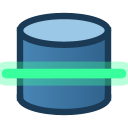

#  TxRay : look into the live transaction of a debugged Java application with DBeaver.

[](https://github.com/RoiSoleil/txray/actions/workflows/build.yml)
[](LICENSE)

The application is stopped on a breakpoint, in the middle of a transaction: rows inserted, updated or locked, and
nothing committed yet. No other database client can see any of it, because the transaction belongs to the
application's session. In the Debug Shell, you can type `connection.createStatement().executeQuery(...)` and read
the result cell by cell.

TxRay does it for you in the DBeaver of your Eclipse. Right-click the suspended thread and choose
*TxRay > Open SQL Console on Thread Connection*. A DBeaver SQL console opens: its SQL runs **on the application's
connection, in its transaction**, and the rows are shown in the DBeaver result grid.

Nothing is added to the application: no agent, no dependency, no change to the launch. Nothing needs to be set up in
DBeaver either: no driver to declare, no connection to create.

# How it works

```
DBeaver SQL console ──TxRay driver──► TxRay plugin ──JDI──► java.sql.Connection of the suspended thread
                      (same Eclipse, direct calls)
```

TxRay contributes a DBeaver driver. When you open a console, TxRay creates a temporary DBeaver connection on that
driver. The driver hands each statement to the plugin, which runs it with method invocations in the suspended thread
(`createStatement`, `execute`, `getResultSet`, `next`, `getString`...). These are the same calls the Debug Shell
makes, done through the debugger's API.

`commit`, `rollback`, `setAutoCommit` and `close` sent by DBeaver are ignored, so the transaction stays under the
application's control. The SQL itself is yours: an `UPDATE` typed in the console becomes part of the application's
transaction.

# Finding the connection of a thread

On a thread or a stack frame of the Debug view, TxRay looks in:

1. **the thread locals** of the thread, where the transaction managers keep the transactional resources:
   Spring `TransactionSynchronizationManager` (`ConnectionHolder`, `EntityManagerHolder`, `SessionHolder`),
   Hibernate `ThreadLocalSessionContext`, maps of them...
2. **the stack**: local variables, `this` and its fields.

It recognizes:

- `java.sql.Connection`, including pool proxies (the SQL goes through them, as for the application);
- Hibernate sessions (5, 6, 7; `connection()` for 3 and 4);
- JPA entity managers;
- the Spring holders.

Fields are read wherever possible, so that no connection is acquired as a side effect. When several connections are
found, you choose. When none is found, or when you prefer, type an **expression** evaluated in the selected frame, as
in the Debug Shell (`session`, `em`, `dataSource.getConnection()`...).

The same command exists on a **variable** of the Variables view and on a **watch expression** of the Expressions view.

The connection stays available until the debug session ends or you use *TxRay > Release Connection*. Each time the
thread is suspended again on a breakpoint or a step, the console can query it. *TxRay > New SQL Console* opens another
console on it.

# Requirements

The DBeaver plugins in the same Eclipse, installed from the DBeaver update site: https://dbeaver.io/update/latest/

# What to know

- The thread must be suspended **on a breakpoint or by a step**. A thread paused with the *Suspend* button cannot
  run methods: the JVM refuses it, and the Debug Shell has the same rule. *Suspend Thread* and *Suspend VM*
  breakpoints both work.
- Do not stop inside the JDBC driver itself (in the middle of an `executeQuery` of the application): the connection
  could be in an inconsistent state.
- Each cell costs one method invocation in the debugged VM. Results are limited to 500 rows by default
  (*Window > Preferences > TxRay*).
- Values come back typed in DBeaver: numbers, booleans, dates, times, timestamps and binaries (4 KB by default per
  value). Other types (intervals, arrays, JSON...) are shown as text.
- The DBeaver navigator stays empty for these connections: TxRay is meant for the SQL editor.

# Update Site

You can find the latest build of TxRay here:

https://github.com/RoiSoleil/txray/raw/update-site/latest/

# Build

Requires JDK 21 and Maven 3.9 (use the Apache distribution: the Maven packaged by some Linux distributions does not
work with Tycho). The target platform is the latest Eclipse release plus the DBeaver update site.

```bash
mvn clean install   # update site in update-site/org.eclipse.txray/target/repository
```

The project has two bundles:

- `bundles/org.eclipse.txray.jdbc`: the JDBC driver, with no dependency. It is tested on its own.
- `bundles/org.eclipse.txray`: the debugger side and the DBeaver integration.

The icons are drawn by `tools/MakeIcon.java`:

```bash
java tools/MakeIcon.java 16 bundles/org.eclipse.txray/icons/txray.png
```

# License

[Eclipse Public License, v2.0](http://www.eclipse.org/legal/epl-v20.html)
